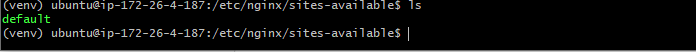
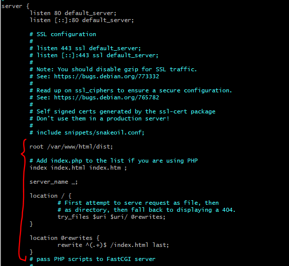
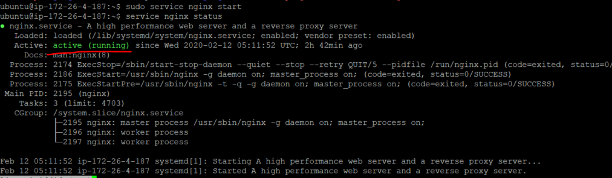
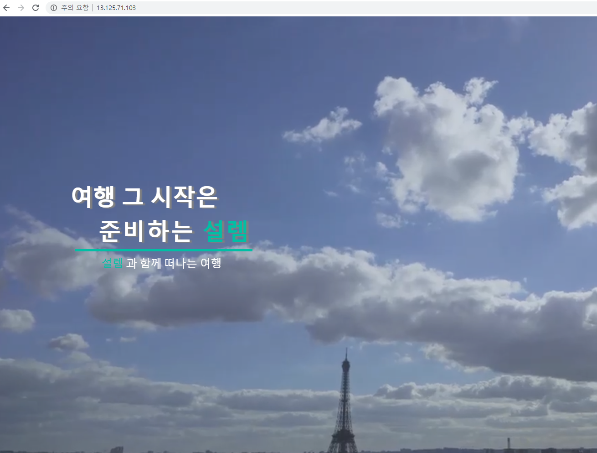
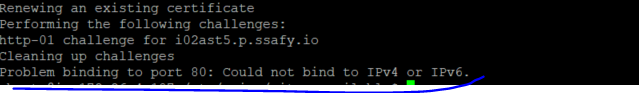
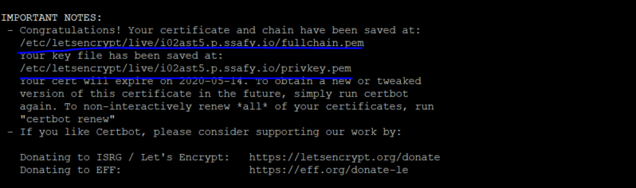
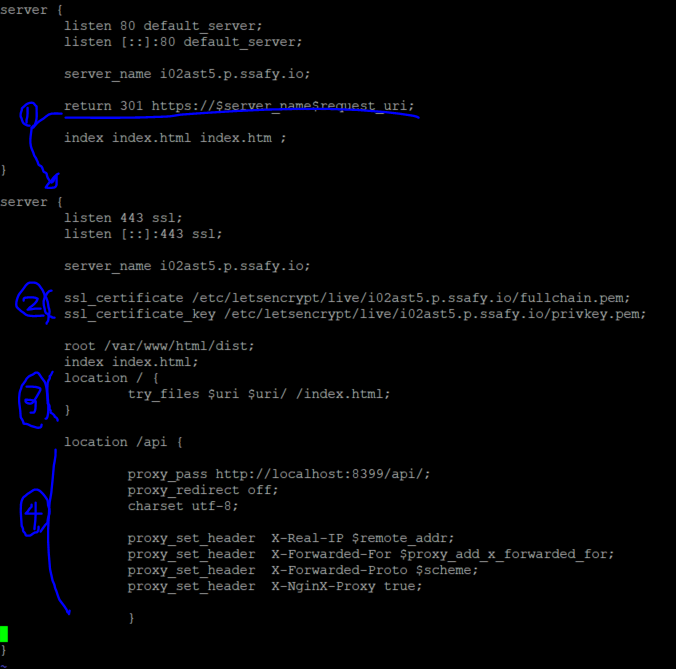
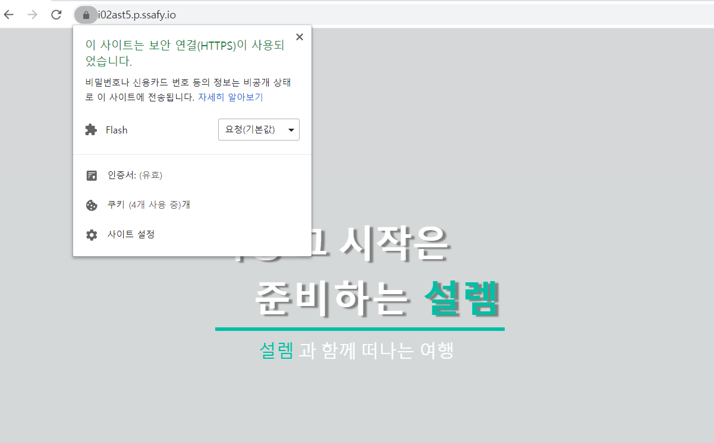
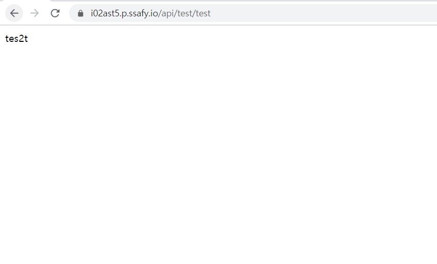

# 1. NginX 설치 및 vue.js 배포하기

### 1) NginX 설치

**nginx 설치**

```shell
sudo apt-get update
sudo apt-get upgrade
sudo apt-get install nginx
```

### 2) conf 파일 설정

$ cd /etc/nginx/sites-availables/

****

다음과 같이 수정합니다



<br>

### 3) 웹서버(Nginx)에 vue.js 소스 올리기

\>npm run build 한 vue.js의 dist 폴더를 아래의 경로에 넣어줍니다

$ cd /var/www/html/

\>   /var/www/html/dist

<br>

### 4) nginx 실행

**nginx 실행**

```shell
$ sudoservice nginx start     #(restart/reload/stop/force-reload)
```


**이미 실행중이라면 restart**

```shell
$ sudoservice nginx restart   #(restart/reload/stop/force-reload)
```

<br>

### 5) 상태확인

**상태확인**

```
$ service nginx status 
or 
$ systemctl status nginx
```




## **6) 배포완료 ( SSL 적용 이전 )**



<br>

<br>

# 2. SSL 적용(HTTPS 설정하기) 및SpringBoot proxy 설정

### 1) letsencrypt 설치하기

```shell
$ sudo apt-get update -y & sudo apt-get install letsencrypt -y
```

<br>

### 2) nginx 중지

인증서 발급을 위해 실행중인 nginx service를 잠시 중지 시킵니다.

```shell
$ sudo systemctl stop nginx
```

\> 80포트 사용중이면 에러



<br>

### 3) 인증서 발급

```
$ sudo letsencrypt certonly --standalone -d [도메인 네임]
ex)$ sudo letsencrypt certonly --standalone -d i02ast5.p.ssafy.io
```

정상적으로 발급되었다면 다음과 같은 축하글과 인증서 키값들을 얻을 수 있다.



<br>

### 4) nginx 설정파일 수정



① 80포트로 진입했을 때 443포트로 리다이렉트 시켜줍니다.

② 위에서 발급받은 인증서 경로 적어줍니다.

③ / 로 접근했을 때 빌드했던 dist 의 index.html에 매핑합니다.

④ 프록시 서버 매핑, 클라이언트로부터 요청이 들어오면 프록시 서버로 던져주고, 응답시 클라이언트로 던져줍니다.

<br>

### 5) nginx 가동

```
$ sudo systemctl start nginx
```

<br>

### 6) 실행결과



